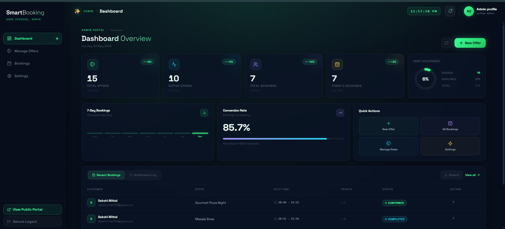

# SmartBooking Notification Service

## Project Overview
SmartBooking Notification Service provides notification delivery and history for the SmartBooking platform. This README attaches the available frontend screenshots and Swagger UI images found in the repository's `images` folder.

## Frontend Screenshots
Below are sample frontend screenshots taken from the `images/frontend images` folder.

## Swagger API
Swagger UI screenshots (from `images/Swagger images`):

## Database Schema
I could not find a file explicitly named `schema.png` in the `images` folder.
If you have a database schema image, please add it at `./images/schema.png` and then update this README to embed it like below:

If you'd like, I can pick an existing screenshot to use as a temporary schema image — tell me which file to use.

---

If you want the images arranged differently (side-by-side, captions, or a gallery), tell me your preferred layout and I'll update the README accordingly.